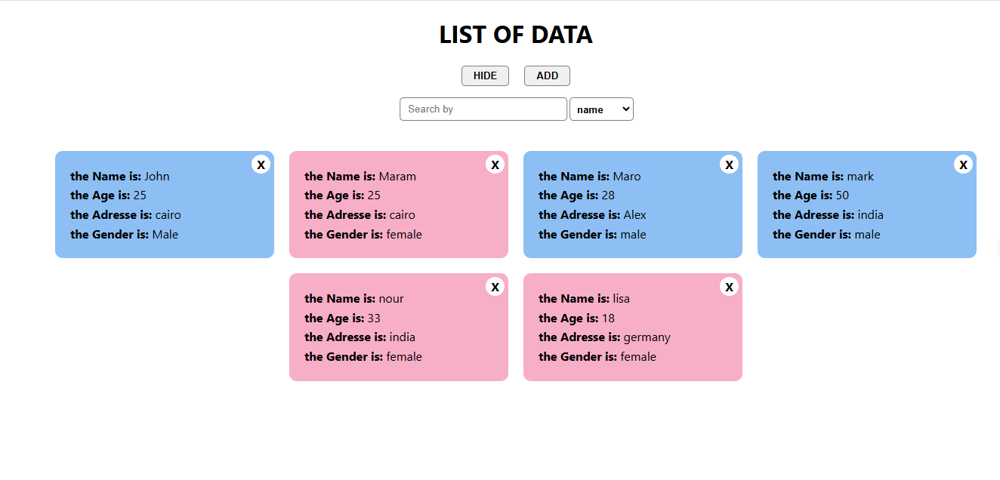

# multiple-filter-react-kimz-ola

This is a simple project that we can use it to add new user or filter them by name,age,address or gender you can also delete it. this multiple-filter project built with React Js [hooks].

## Table of contents

- [Overview](#overview)
- [Features](#Features)
- [Installation](#Installation)
- [Usage](#Usage)
- [Links](#Links)
- [Screenshot](#Screenshot)
- [What I learned](#what-i-learned)
- [Continued development](#continued-development)
- [Author](#author)
- 

## overview
This is a simple project that we can use it to add new user or filter them by name,age,address or gender you can also delete it. this multiple-filter project built with React Js [hooks].

## Features
- add new user
- filter them by name,age,address or gender
- delete a user


## Installation
To get started with this project, follow these steps:

you can clone the project or download it as Zip file.
1. Clone the repository:
   ```bash
   git clone https://github.com/olahasan/multiple-filter-react-kimz-ola.git

2. Navigate to the project directory:
   cd <project-directory>

3. Install the required dependencies:
   npm install   


## Usage
To run the application, use the following command:

npm start


## Links

If you want to open the link in a new tab, you can:

- Press **Ctrl** (or **Cmd** on Mac) while clicking the link.
- Right-click the link and select **Open link in new tab**.

Otherwise, all links will open in the same tab.


- Solution URL: [here](https://github.com/olahasan/multiple-filter-react-kimz-ola)

- Live Site URL: [here](https://multible-filter-react-kimz-ola.surge.sh/) OR  [here](https://multiple-filter-react-kimz-ola.netlify.app/)

 ## Screenshot
 



## what-i-learned
- I learned in this simple project how to create react app.
- how to add,delete users.
- how to filter users by name,age,address or gender.
- how to deploy it on netlify and serge.

## Continued Development
In the future, I plan to:
- learn more about reactJs Hooks and cookies,localstorage.

### Author

GitHub - @olahasan
